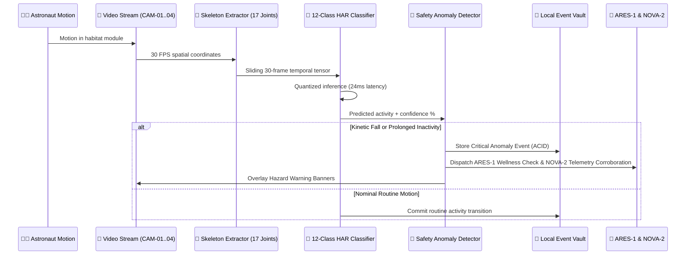
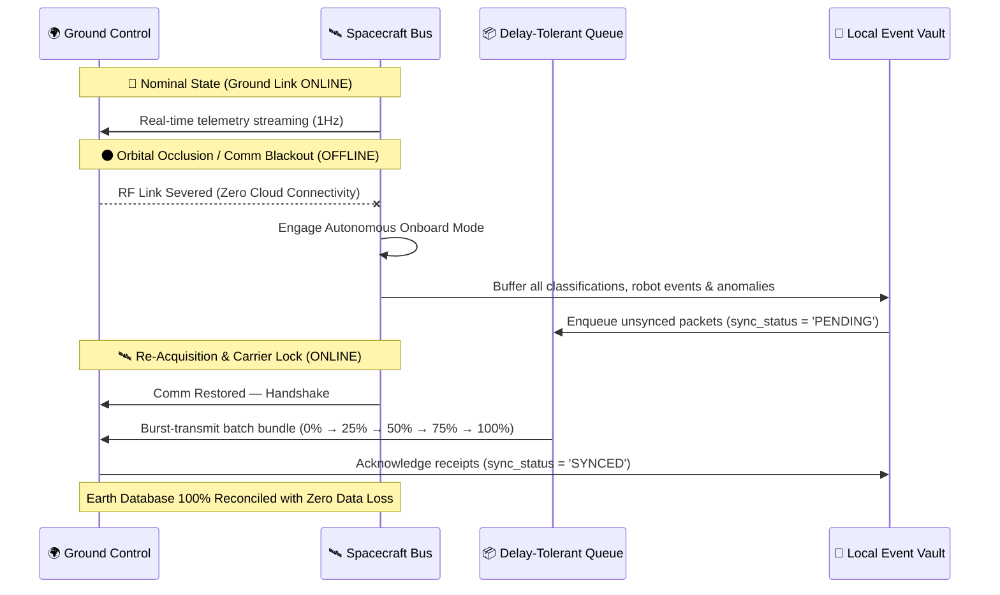

# ASTROSENSE System Architecture & Technical Specification

> **AI-Powered Onboard Human Activity Recognition & Autonomous Crew Monitoring System**  
> *Zero-Cloud • Delay-Tolerant • Edge AI • Offline-First Space Mission Architecture*

---

## 1. High-Level System Architecture

```mermaid
flowchart TD
    subgraph Spacecraft["🛰️ Spacecraft Onboard Habitat (Edge Node)"]
        subgraph Sensors["Optical & Telemetry Inputs"]
            CAM1["CAM-01 (Lab)"]
            CAM2["CAM-02 (Quarters)"]
            CAM3["CAM-03 (Workstation)"]
            CAM4["CAM-04 (Exercise)"]
            ECLSS["ECLSS & Telemetry Bus"]
        end

        subgraph EdgeAI["Local Inference & Reasoning Engine"]
            HAR["12-Class HAR Pose Classifier (ST-GCN / ConvLSTM)"]
            Anomaly["Heuristic Anomaly Detector (Fall / Inactivity)"]
            VoiceEngine["Local NLP Voice Engine (Web Speech + Offline Parser)"]
            SpaceAI["Local Space Knowledge Engine (30+ Verified Topics)"]
        end

        subgraph Robots["Autonomous Robotic Assistants"]
            ARES["ARES-1 (Crew Support Robot)"]
            NOVA["NOVA-2 (Engineering Robot)"]
            InterComm["Robot-to-Robot Mesh Bus"]
            ARES <--> InterComm <--> NOVA
        end

        subgraph Routine["Circadian Routine Engine"]
            Scheduler["4-Crew Routine Manager"]
            Announcements["Acoustic Voice Broadcaster"]
        end

        subgraph Storage["Resilient Onboard Storage"]
            SQLite["ACID Local Event Vault (SQLite / WAL)"]
            SyncQueue["Delay-Tolerant Offline Queue"]
        end

        subgraph UI["Onboard Human-Machine Interfaces"]
            Dash["Onboard Dashboard"]
            Monitor["Mission Monitor & Video Matrix"]
            VoiceUI["Astrosense Voice Assistant"]
            RobotUI["Robot Control Center"]
            RoutineUI["Crew Routine Timetable"]
        end
    end

    subgraph Ground["🌍 Earth Mission Control (Ground Station)"]
        DSN["Deep Space Network (DSN Madrid / Goldstone / Canberra)"]
        GroundControl["Ground Mission Control Dashboard"]
        AuditDB["Earth Historical Mission Database"]
    end

    Sensors --> EdgeAI
    EdgeAI --> Anomaly
    EdgeAI --> Dash
    EdgeAI --> Monitor
    Anomaly --> SQLite
    Anomaly --> ARES
    Anomaly --> NOVA
    ARES --> Scheduler
    Scheduler --> Announcements
    EdgeAI --> SQLite
    Robots --> SQLite
    SQLite --> SyncQueue

    SyncQueue -->|Communication Online / Telemetry Downlink| DSN
    SyncQueue -.->|Communication Blackout (Stored in Flash)| SQLite
    DSN --> GroundControl --> AuditDB
```

---

## 2. Component Pipelines

### 2.1 Optical & Human Activity Recognition Pipeline


### 2.2 Communication Blackout & Delay-Tolerant Re-Synchronization


---

## 3. Technology Stack

| Tier | Component | Technology | Rationale |
| :--- | :--- | :--- | :--- |
| **Frontend** | UI Framework | React 18 + TypeScript + Vite | Blazing fast rendering, deterministic types |
| **Styling** | Aerospace Theme | Tailwind CSS + Vanilla CSS Tokens | Dark mode aerospace aesthetic, cyan/indigo accents |
| **Icons** | Visual Language | Lucide Icons | Clean, standardized vector icons |
| **Audio** | Sound Synthesis | Web Audio API + Speech Synthesis | Zero external audio asset dependencies |
| **Backend** | API Server | Node.js + Express + TypeScript | Lightweight edge node runtime |
| **Persistence** | Database Engine | SQLite / JSON ACID Vault | Embedded, zero-configuration local persistence |
| **Speech** | Voice Engine | Web Speech API + Local NLP Matcher | 100% offline speech recognition & verbal playback |
| **Data Provenance**| Simulation Engine | Local Physics & Telemetry Simulator | Clearly labeled synthetic data generator |

---

## 4. Hardware Sizing & Flight Constraints

- **Processor**: ARM64 / x86 embedded SoC (e.g., NVIDIA Jetson Orin Nano, Raspberry Pi CM4, Space-grade RAD5545).
- **Power Envelope**: < 15 Watts average draw.
- **Memory Footprint**: < 256 MB RAM for server runtime, < 80 MB for web client.
- **Storage Requirement**: < 100 MB for local software stack and 10,000+ cached mission events.
- **Network Dependency**: **0% (Zero-Cloud)**. Operates indefinitely without internet access.
